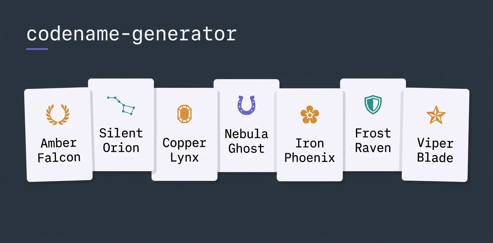

# codename-generator

<p align="center">
   <b>English</b> ·
   <a href="README.de.md">Deutsch</a>
</p>

---

<p align="center">
  
</p>

[](https://github.com/michaelblaess/codename-generator/stargazers)
[](https://github.com/michaelblaess/codename-generator/network/members)
[](https://github.com/michaelblaess/codename-generator/issues)
[](https://github.com/michaelblaess/codename-generator/pulls)
[](https://github.com/michaelblaess/codename-generator/commits/main)
[](https://github.com/michaelblaess/codename-generator/actions/workflows/ci.yml)
[](LICENSE)
[](https://www.python.org/)
[](src/codename_generator/data/themes)

A terminal codename generator. Pick a theme (Greek gods, racehorses, gemstones, whisky, ...), get a batch of unique suggestions (10 to 40, your pick) combined with adjective or verb modifiers and optional phonetic mutations.

## Themes

Greek gods · Egyptian gods · Norse gods · Constellations · Zodiac · Animals · Dangerous animals · Racehorses · Flowers · Gemstones · Wines · Whisky · Mountains · Mushrooms · Historic ships · Landmarks · Dev · Air traffic control · Random (pooled)

German themes (`language: de`): Tierwelt · Sagenwesen · Wetter und Landschaft · Random (DE)

Themes whose words are proper names (Greek/Egyptian/Norse gods, racehorses,
mountains, landmarks, historic ships, whisky, wines) are marked
`language: neutral`. They show up in every language and take the modifiers of
the one you picked - `Silent Secretariat` in English, `Stiller Secretariat` in
German.

Two themes use their own curated word pools:

- **Evocative** - a stark adjective + an emotionally charged noun
  (`Cold Ember`, `Iron Hour`, `Sacred Tide`). Never mutated.
- **Power words** - single bold standalone words, no modifiers
  (`Mythos`, `Skyline`, `Oracle`, `Aegis`).

A theme YAML can override the global modifier pools (`adjectives`, `verbs`),
restrict the name `patterns`, disable mutation (`mutate: false`) or set the
mutation level it starts at (`default_mutation`).

## Setup

```
setup.bat        # Windows
./setup.sh       # macOS/Linux
```

Requires [uv](https://docs.astral.sh/uv/).

## Usage

### TUI (default)

```
run.bat          # Windows
./run.sh         # macOS/Linux
uv run codename  # any platform
```

Keys: `r` regenerate · `n` copy name · `f` favorite · `+` your own idea · `o` your own word · `w` keep word · `m` keep modifier · `l` language · `s` settings · `i` info · `q` quit. Not in the footer: `c` copy slug, `v` favorites, `u` mutation +25%, `t` colour theme, `?` every key.

The layout follows the shared convention of all my TUIs ([SHORTCUTS.md](https://github.com/michaelblaess/textual-widgets/blob/main/SHORTCUTS.md)). Under `s` -> *Keyboard* you can switch to function keys (F1 info, F2 settings, F5 regenerate, F7 own word, F8 keep word, F9 keep modifier, F10 language - the letters stay next to them), plus vim navigation for the table. Own bindings go into `settings.json` under `keymap_custom`, `?` shows what is bound right now.

**Your own word** (`o`, entry *Custom Seed*): your word is combined with adjectives and
verbs or, via *Seed partner* in the settings panel, with the words of a theme
(`Sitemap Orion`, `Pegasus Sitemap`). *Seed position* decides whether your word stands
in front or at the back. With a partner theme only the partner's word mutates, yours
stays as typed. A fixed position or a partner theme sets the name to two words.

**Theme mix** (*Mix with* in the settings panel): the active theme is crossed with a
second one, every name takes one word from each (`Snowdon Lepus`, `Fomalhaut
Lhotse`). No word appears twice in a batch. Themes of the other language work too, they
carry their language code in the list (`Tierwelt (DE)`).

**Varying:** `w` keeps the word of the highlighted suggestion and rolls new modifiers
(`Silent Falcon` -> `Falcon Runner`), `m` keeps the modifier and swaps the word
(`Silent Falcon` -> `Silent Otter`, `Silent Lynx`; German inflects it per gender). From a
variant, `w`/`m` go on from there, `r` rerolls, picking a theme in the list goes back.

**Methods** (bar above the list): *Theme words* is the classic way. *Coined words* invents
new words that sound like the theme (`Lintora`, `Nories`), a mix partner adds its sound.
*Blends* melt two theme words at a shared letter (`Orion` + `Taurus` = `Orisker`), with a
mix partner the back half comes from the second theme. *Acronym* takes up to three letters,
every word of the name starts with its letter (`SM` -> `Silent Marten`). Coined words and
blends take modifiers like any theme word.

**Tone** limits the modifiers to one mood: dark, bright, noble, swift, calm or fierce.
**Filters:** *Starts with*, a syllable limit and *Alliteration* - the modifiers are then
drawn with the initial of the theme word, not just filtered. *Sort by sound* puts the
best-sounding names first, the *Sound* column shows the score (0-100: short, easy to say
and to spell). With a filter a larger pool is drawn, the info line says when fewer names
pass. `Esc` in a text field returns to the list.

The left settings panel has three sliders - **mutation chance** (0-100%),
**word count** (1, 2 or 3 visible words per name) and **suggestions**
(10/20/30/40 names per batch) - plus a **language** dropdown (see
[Languages](#languages)). Moving a slider re-renders the *current* set of
names in place so you see the effect immediately — only `r` draws a fresh
batch. Each theme keeps its own set, so switching themes back and forth never
loses what you had. Hover a theme in the list for a tooltip describing it.
Right-click any suggestion for a context menu (copy slug/name, favorite,
regenerate). The theme list starts with a **Favorites** entry — selecting it
lists your saved favorites on the right, where only the mutation slider
applies and re-mutates them live. Ships with 35+ colour themes (Textual
built-ins plus retro palettes) — switch with `t` or the Ctrl+P theme picker.
Chosen colour theme, mutation chance, word count, suggestion count, method,
tone, filters and favorites are persisted to `~/.codename-generator/settings.json` across
restarts.

### CLI

```
uv run codename --list-themes
uv run codename -t greek-gods           # 30 suggestions (default)
uv run codename -t flowers -n 5 --mutation-chance 0.6 --seed 42
uv run codename -t random -n 20         # pulls from every theme
uv run codename -t whisky --words 3     # exactly 3 components per name
uv run codename --list-themes --lang de  # German plus the neutral themes
uv run codename -t tierwelt -n 10       # German names, inflected
uv run codename -t racehorses --lang de  # proper names, German modifiers
uv run codename -w Sitemap              # your own word with modifiers
uv run codename -w Sitemap -t constellations --position front   # Sitemap Orion ...
uv run codename -t whisky --mix constellations   # Snowdon Lepus ...
uv run codename -t animals --tone dark                     # only dark modifiers
uv run codename -t whisky --method coined --words 1        # Lintora, Nories ...
uv run codename -t whisky --mix constellations --method blend --words 1
uv run codename -t animals --method acronym --letters SM   # Silent Marten ...
uv run codename -t animals --initial s --max-syllables 3 --alliteration --sort
uv run codename --export-favorites favorites.json          # for the web version
uv run codename --import-favorites favorites.json          # web export or settings.json
```

**Favorites between TUI and web:** both use the same format. `--export-favorites` writes
a file the web version imports (*Import* in its list), the web's *Export* goes back in with
`--import-favorites`. A `settings.json` works as import file, too. Known names are skipped.

A `*` next to a suggestion means a phonetic mutation was applied
(`Pegasus -> Pegasos`, `Carnation -> Carnatiyn`, `Frankel -> Frankil`).

## Adding themes

Drop a YAML file into `src/codename_generator/data/themes/`:

```yaml
name: My Theme
description: ...
words:
  - Word1
  - Word2
```

The modifier lists under `data/modifiers/<lang>/` carry a `tones:` map (tone -> words). A
word may have several tones or none, every word there must also be in `words` - the loader
refuses anything else.

## Languages

A theme declares its language, and that language decides which modifier pools
it draws from, how the name is put together and whether the modifier gets
inflected. Themes without a `language` key are English. A theme of proper
names uses `language: neutral` - it stays visible in every language and
borrows the modifiers of whichever one is active.

```yaml
name: Tierwelt
description: Heimische Tiere
language: de
words:
  - Falke|m
  - Eule|f
  - Wiesel|n
```

The `|m` / `|f` / `|n` / `|p` marker is the grammatical gender of the noun.
German inflects an attributive modifier after it - `still` becomes
`Stiller Falke`, `Stille Eule`, `Stilles Wiesel`. Without a marker the
masculine form is used. Languages that do not inflect (English) ignore it.

Modifier pools live per language in
`src/codename_generator/data/modifiers/<lang>/` - `adjectives.yaml`,
`verbs.yaml` and `agents.yaml`. A language without its own folder falls back
to the English pools. German verbs are present participles (`jagend`,
`lauernd`), because that is what German puts in front of a noun.

Word order differs too: German never trails a participle, so `theme-verb`
("Falke Jagend") is dropped and three-word names use `adj-verb-theme`
("Stiller Jagender Falke") instead of `adj-theme-verb`.

Each language gets its own **Random** theme (`random`, `random-de`, ...) so
pooled draws never mix a German noun with an English adjective - neutral
themes feed into all of them.

Pick the language in the settings panel (bottom dropdown) or cycle it with
`l`. The theme list then shows that language plus the neutral themes, and
every name is generated with its modifiers. On the CLI, `--lang` does the same
for `--list-themes` and for generation. The setting is persisted like the
sliders. Slugs stay ASCII: umlauts are written out
(`Grüner Blitz -> gruener-blitz`), accents are stripped
(`Volupté -> volupte`).

## Credits

The settings sliders use [textual-slider](https://github.com/TomJGooding/textual-slider)
by [Tom J Gooding](https://github.com/TomJGooding) - thank you for the widget.

## License

Apache License 2.0 - see [LICENSE](LICENSE).
